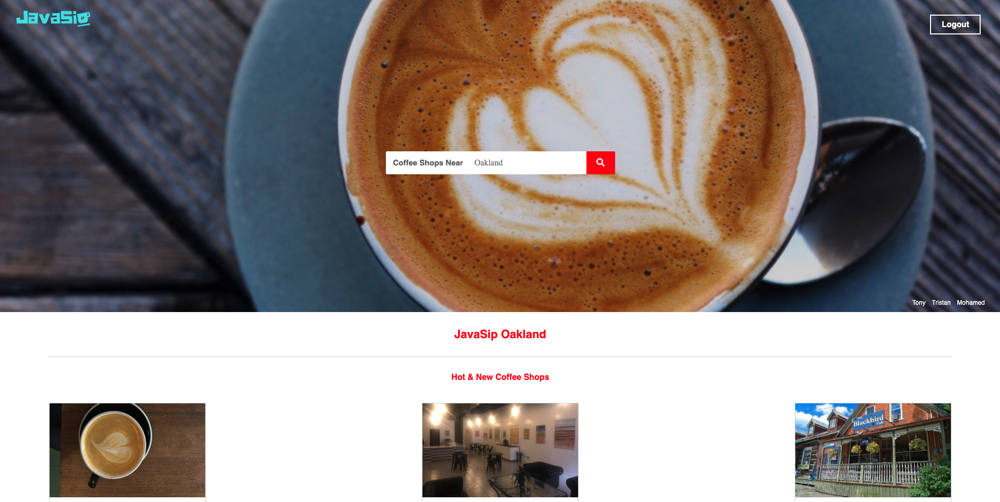
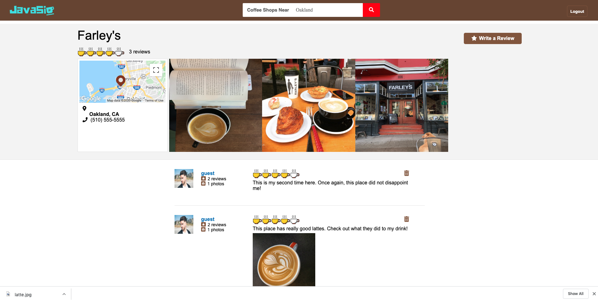
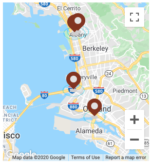

# [JavaSip](http://java-sip.herokuapp.com/#/)

## Technologies

* MongoDB
* Express 
* React
* NodeJS
* Google Map API

## Summary

JavaSip is a yelp clone inspired by our love for finding great tasting coffee. Users can search for coffee shops by location (Oakland, San Francisco, or San Jose) and then post ratings, comments, and pictures related to these businesses. 

Features for this group project were divided and designated to team members. I was responsible for both front-end and back-end development for the business show page as well as modifying the Google Map API to handle search functionality. 



## Business Show

Users can view information for a specific coffee shop. The average rating is listed at the top along with the location marked on a Google map. The photos next to the map offers a sense of the ambience for a particular coffee shop. If a user is logged in, they can click the "Write a Review" button to rate, comment, and post a photo. 



## Google Map API

The map was originally set up using a fixed location for its center. This forced the user to scroll through the map to find specific coffee shops. Also, the center would not rerender when a new location was submitted in the search field. 

By passing the search term as props to the map component and reassigning longitudinal and latitudinal boundaries in a lifecycle method to compares current and incoming props, I was able to recenter the map and display all business markers for a given location:



```javascript
componentWillReceiveProps(nextProps) {
    if (nextProps.search !== this.props.search) {
      if (nextProps.search === "Oakland") {
        this.setState({center: { lat: 37.834416, lng: -122.300707 }});
      } else if (nextProps.search === "San Francisco") {
        this.setState({center: { lat: 37.7758, lng: -122.435 }});
      } else if (nextProps.search === "San Jose") {
        this.setState({center: { lat: 37.375240, lng: -121.877454 }});
      }
    }
  }

  render() {
    return (
      <div style={{ height: '325px', width: '300px' }}>
        <GoogleMapReact
          bootstrapURLKeys={{ key: APIkey  }}
          center={this.state.center}
          defaultZoom={11}
        >
          {this.placeMarkers()}
        </GoogleMapReact>
      </div>
    );
  }
}  
```

## Express Routing

One of the biggest challenges when working with Express endpoints was building json responses to obtain data that would be maniipulated on the frontend. For example, I needed all reviews for a specific user in order to render total number of photos. The first step was to write a static method to return all reviews given a user id. I then invoked the method in a user route and attached the returned object to a users object, which eventually gets iterated over to give me the total count. 

```javascript
ReviewSchema.statics.getReviewsByAuthorId = function (authorId) {
  return Review.find({ author: authorId })
    .then(reviews => reviews)
    .catch(err => err);
};
```

```javascript
router.get("/", async (req, res) => {
  const usersObj = {};
  const users = await User.find();
  for (let index = 0; index < users.length; index++) {
    const user = users[index].toJSON();
    const reviews = await Review.getReviewsByAuthorId(user._id);
    let photoCount = 0;
    for (let i = 0; i < reviews.length; i++) {
      let review = reviews[i];
      let photos = await getImages(review.id);
      photoCount += photos.length;

    }
    user.photoCount = photoCount;
    user.reviews = reviews;
    usersObj[user._id] = user
  }
  getImages('profiles').then(avatars => res.json({usersObj, avatars}))
});
```

## Future Implementations

* Update markers and redisplay businesses according to map boundaries
* Add more locations and seed data 


